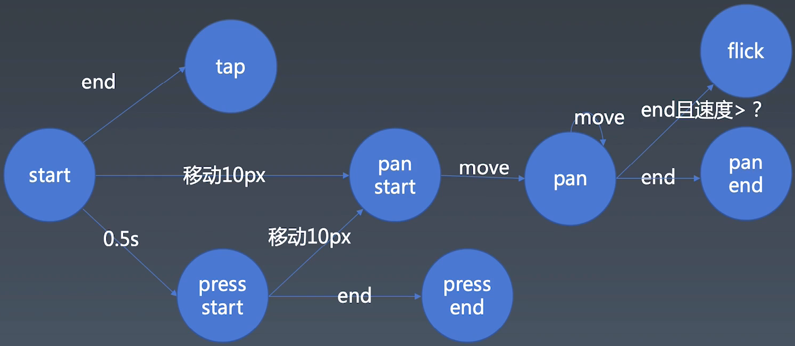

学习笔记

本周学习了关于手势库的封装

* 整个手势的走向图


* 在移动端的 touch 事件中的要点

  * 每一个 touch 都有一个 identifier 属性，表示一个可以唯一地识别和触摸平面接触的点的值. 这个值在这根手指（或触摸笔等）所引发的所有事件中保持一致, 直到它离开触摸平面 - [MDN](https://developer.mozilla.org/zh-CN/docs/Web/API/Touch/identifier)

* 在PC端的 mouse 事件中的要点

  * event.button 表示当前按下的鼠标按键，具体描述看[MDN](https://developer.mozilla.org/zh-CN/docs/Web/API/MouseEvent/button)

  * event.buttons 表示事件触发时，那些按键被按下，具体描述看[MDN](https://developer.mozilla.org/zh-CN/docs/Web/API/MouseEvent/buttons)

  * 由于 mousemove 事件是不需要按下任何按键就可以触发的，所以 event.buttons 的值和 event.button 的值需要做兼容处理
  ```
    # event.button 中，每个按键对应的值
    0  -> 主按键，通常指鼠标左键或默认值
    1  -> 辅助按键，通常指鼠标滚轮中键
    2  -> 次按键，通常指鼠标右键
    3  -> 第四个按钮，通常指浏览器后退按钮
    4  -> 第五个按钮，通常指浏览器的前进按钮

    # event.buttons 中，每个按键对应的值
    0  -> 0b00000 -> 没有按键或者是没有初始化
    1  -> 0b00001 -> 鼠标左键
    2  -> 0b00010 -> 鼠标右键
    4  -> 0b00100 -> 鼠标滚轮或者是中键
    8  -> 0b01000 -> 第四按键 (通常是“浏览器后退”按键)
    16 -> 0b10000 -> 第五按键 (通常是“浏览器前进”)

    # 由 event.buttons 推出对应的 event.button 的值，忽略 0 的情况
    1  -> 1 << 0
    2  -> 1 << 1
    4  -> 1 << 2
    8  -> 1 << 3
    16 -> 1 << 4

    # 最终的公式为
    buttons = 1 << button

    # 获取当前鼠标按下了那些按键
    while(button <= buttons) {
      
      if (button & buttons) {
        // 说明当前按下了 button
        // 有一个注意项，buttons 和 button 中右键和中键的顺序不一样，所以需要调整两者的位置
      }
      
      button = 1 << button
    }

  ```


